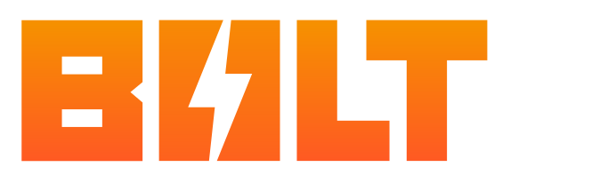
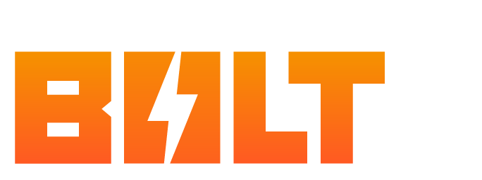
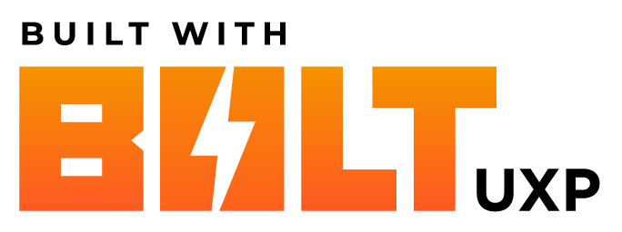
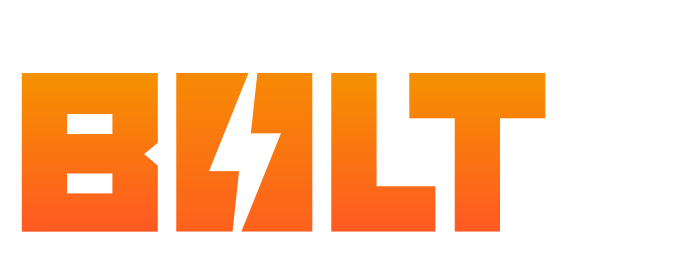
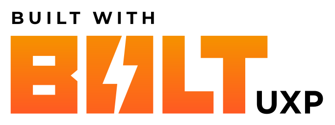
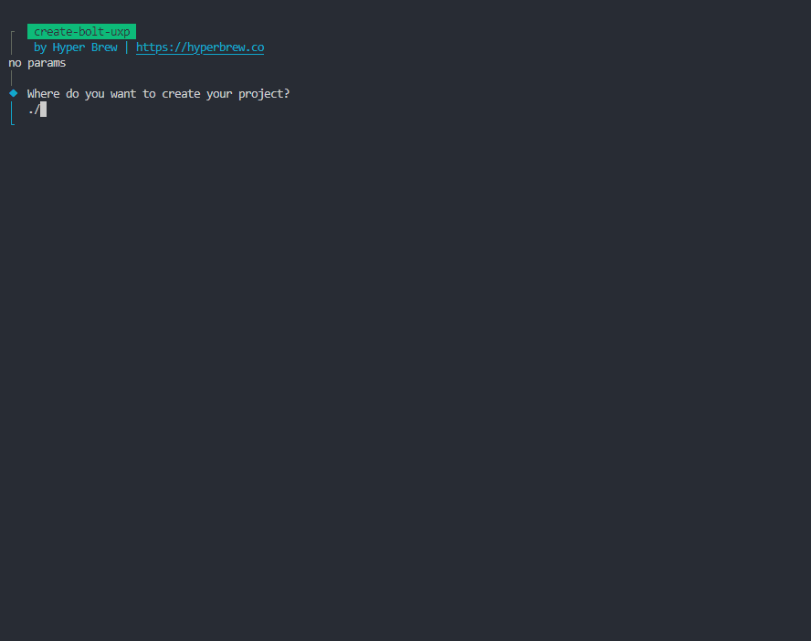

A lightning-fast boilerplate for building Adobe UXP Plugins in Svelte, React, or Vue built on Vite + TypeScript + Sass


[](https://github.com/hyperbrew/bolt-uxp/blob/master/LICENSE)
[](https://discord.gg/PC3EvvuRbc)

## Features

- Lightning Fast Hot Reloading on changes
- Setup with TypeScript Definitions for UXP and Photoshop APIs
- Easily configure in uxp.config.ts
- Comes with multi-host-app configuration
- Optimized Build Size
- Template for UXP Hybrid C++ Plugins
- Easy Publish to CCX for Distribution
- Easy Package to ZIP archive with sidecar assets
- GitHub Actions ready-to-go for CCX Releases

## Backers

Huge thanks to our backers who have made this project possible!

<a href="https://aescripts.com/" target="_blank">
</a>

If you're interested in supporting this open-source project, please [see our sponsor page](https://github.com/sponsors/hyperbrew).

## Support

### Free Support 🙌

If you have questions with getting started using Bolt UXP, feel free to ask and discuss in our free Discord community [Discord Community](https://discord.gg/PC3EvvuRbc).

### Paid Priority Support 🥇

If your team is interested in paid consulting or development with Bolt UXP, please [contact the Hyper Brew team](https://hyperbrew.co/contact/). More info on our [Adobe Plugin Development & Consulting Services](https://hyperbrew.co/landings/boost-development)

## Can I use Bolt UXP in my free or commercial project?

Yes! Bolt UXP is **100% free and open source**, being released under the MIT license with no attribution required. This means you are free to use it in your free or commercial projects.

We would greatly appreciate it if you could provide a link back to this tool's info page in your product's site or about page:

Bolt UXP Info Page Link: https://hyperbrew.co/resources/bolt-uxp

**Built with Bolt UXP** button graphics:

**PNG Files**

<div style="display:flex;gap:1rem;">
<a href="./src/assets/built-with-bolt-uxp/Built_With_BOLT_UXP_Logo_White_V01.png" target="_blank">
</a>

<a href="./src/assets/built-with-bolt-uxp/Built_With_BOLT_UXP_Logo_Black_V01.png" target="_blank">
</a>

</div>

**SVG Files**

<div style="display:flex;gap:1rem;">
<a href="src/assets/built-with-bolt-uxp/Built_With_BOLT_UXP_Logo_White_V01.svg" target="_blank">
</a>

<a href="src/assets/built-with-bolt-uxp/Built_With_BOLT_UXP_Logo_Black_V01.svg" target="_blank">
</a>

</div>

## Prerequisites

- [Node.js 18](https://nodejs.org/en/) or later
- [Adobe UXP Developer Tool (aka UDT)](https://developer.adobe.com/photoshop/uxp/2022/guides/devtool/installation/)
- Package manager either
  - NPM (comes with Node.js)
  - [Yarn](https://classic.yarnpkg.com/lang/en/docs/install/) ( ensure by running `yarn set version classic` )
  - [PNPM](https://pnpm.io/installation) ( ensure by running `pnpm --version` )

## Quick Start



Create your new Bolt UXP project (follow CLI prompts)

- yarn - `yarn create bolt-uxp`
- npm - `npx create-bolt-uxp`
- pnpm - `pnpm create-bolt-uxp`

Change directory to the new project

- `cd project`

Install Dependencies (if not already done by create command)

- yarn - `yarn`
- npm - `npm i`
- pnpm - `pnpm i`

Build the plugin (must run before `dev`, can also run after for panel to work statically without the process)

- yarn `yarn build`
- npm `npm run build`
- pnpm `pnpm build`

Run the plugin in hot reload mode for development with UDT (see below)

- yarn `yarn dev`
- npm `npm run dev`
- pnpm `pnpm dev`

Build & Package the plugin as a CCX for delivery (separate CCX files for each host are generated due to current UXP requirements)

- yarn `yarn ccx`
- npm `npm run ccx`
- pnpm `pnpm ccx`

Bundles your packaged ccx file(s) and specified assets from `copyZipAssets` to a zip archive in the `./zip` folder

- yarn `yarn zip`
- npm `npm run zip`
- pnpm `pnpm zip`

## UDT Setup

_Install Note: The Adobe UXP Developer Tools (UDT) can be downloaded from the Adobe CC app_

### Add Plugin

1. Open the Adobe UXP Developer Tool (2.0 or later)
2. Click the `Add Plugin` button in the top right corner
3. Select the `manifest.json` file in the `dist` folder

### Load and Debug Plugin

1. Click `Load` button on your plugin item
2. Click `Debug` button on your plugin item

_Note: You only need to "Load" a plugin, do not use the "Load and Watch" feature. The bulit-in UDT file watcher aka "Load and Watch" does not reliably update on changes so we recommend avoiding it. Instead, Bolt UXP comes with it's own built-in WebSocket system to trigger a reload on each update which is more consistent and less error-prone._

## Install a Plugin

You can install your UXP plugin from CCX file in a number of ways:

### A. The ZXP / UXP Installer from aescripts + aeplugins

Download here: https://aescripts.com/learn/zxp-installer/ Simply drag and drop the CCX file onto the installer and follow the prompts.

### B. The Adobe CC App (UPIA under the hood)

As long as file associations are set up correctly, you can simply double click the CCX file to install it and you can follow the prompts in the Adobe CC app to complete the install

### C. UPIA (Adobe's UXP Plugin Installer)

You can install via the command line directly with the UPIA tool.

Windows:

```
cd "C:\Program Files\Common Files\Adobe\Adobe Desktop Common\RemoteComponents\UPI\UnifiedPluginInstallerAgent"

UnifiedPluginInstallerAgent.exe /install /path/to/plugin.ccx
```

Mac:

```
cd "/Library/Application Support/Adobe/Adobe Desktop Common/RemoteComponents/UPI/UnifiedPluginInstallerAgent/UnifiedPluginInstallerAgent.app/Contents/MacOS"

./UnifiedPluginInstallerAgent --install /path/to/plugin.ccx
```

### Where are UXP Plugins Installed to?

The resulting directory can end up in any number of places depending on UPIA version and settings. This location is subject to change and managed by UPIA and the UXP database. In general do not modify or try to manipulate these locations or you will likely break the plugin.

Windows:

- `C:\Program Files\Common Files\Adobe\UXP\Plugins\<username>\External\`
- `C:\Users\<username>\AppData\Roaming\Adobe\UXP\Plugins\External\`

Mac:

- `/Users/<username>/Library/Application Support/Adobe/UXP/Plugins`

_Special Note_
You cannot write UXP plugins directly into the directories above like you could with CEP panels. UXP plugins must be installed via either double-click or UPIA in order to correctly update a database file.

## Supported Adobe Apps

Currently the following Adobe apps support UXP plugins:

- Photoshop
- InDesign
- Premiere Pro Beta

If you have UXP Beta access to any of the other Adobe apps, you can add them as well, including:

- Illustrator (beta)

_Note: Bolt UXP will not work out of-the-box for apps in UXP beta, you will need beta access from Adobe app teams as they become available. Hyper Brew cannot assist you in this, you will need to contact Adobe app teams directly for access._

## Multi-Window panels

To add additional windows to a UXP Plugin, you'll need to do 2 things:

1. Add an additional panel in the `uxp.config.ts` (see the settings example commented out)
2. Add a `<uxp-panel panelid="bolt.uxp.plugin.settings">` tag to your main entrypoint file (.tsx, .vue, or .svelte). Note that the `panelid` must match the panelid in the `uxp.config.ts` file.

Note: Unlike CEP Extensions which multi-panel extensions behave as separate isolated panels/websites, a multi-panel UXP plugin is all in 1 space with certain sections of the markup rendered in different panels (identified by the `<uxp-panel />` tag)

## Webview UI Option

Bolt UXP now comes with the option of enabling a Webview UI when you create a new project.

_If you are new to UXP, we recommend you leaving the Webview option disabled as it adds to the complexity of your project._

Enabling the Webview UI option now allows you to build your User Interface with full CSS/HTML/JS DOM support following Edge on Windows and Safari on MacOS.

Enabling Webview UI will however add to the complexity of your project creating 2 separate contexts for:

- UI >> `webview-ui/*`
- UXP Backed >> `src/*`

All Exported Functions in your uxp and app files are exposed to the Webview:

- `src/api/uxp.ts` - Global Functions
- `src/api/(photoshop/indesign/premierepro/etc).ts` - App-Specific Functions

In the Webview context, you can call these async methods and get responses with type-safety with the `api` object:

**Call UXP Functions from Webview**

```js
await api.getProjectInfo();
await api.getUXPInfo();
```

In a similar way, you can write functions in the webview context that get called by the UXP context by writing:

- `webview-ui/src/webview-api.ts` - Webview functions exposed to UXP

**Call Webview Functions from UXP**

```js
webviewAPIs = await webviewInitHost({ multi: true });
[mainWebviewAPI] = webviewAPIs;

await mainWebviewAPI.pingWebview();
```

Since the Webview and UXP are separate contexts, make sure to only return primative types (strings, numbers, booleans, arrays, static objects, etc). Any references or object instances returned will not be preserved.

## Webview UI - Debugging

The Webview UI option will create 2 separate JS contexts, UXP & Webview UI.

- **UXP Context:** Debug with the Adobe UXP Developer Tools
- **Webview UI Context:** Debug with webview devtools with right click > "Inspect" on the UI
  - _Note: this context menu can be overridden in production if desired_

## Webview UI - Multi Panel Plugins

If you want to use Webview mode with multi-panel plugins, first follow the steps in [Multi-Window panels](#multi-window-panels) to setup the uxp.config.ts and add the `<uxp-panel />` element for secondary panels.

Run build again and reload your UXP plugin.

Ensure `webviewInitHost({ multi: true });` is enabled

Now when you build, webviews will be created and override your UI for each secondary panels in your config.

Comlink Origin Warnings in the console are normal and can be ignored, this is just to prevent duplicate events.

To call different APIs in different webviews, you can deconstruct the `webviewAPIs` array in order of panels listed in the `uxp.config.ts`

```js
const [mainWebviewAPI, settingsWebviewAPI] = webviewAPIs;
mainWebviewAPI.doThisFunction();
settingsWebviewAPI.doThatFunction();
```

In your Webview UI, you can conditionally render UI for different windows with the `page` variable from the url param.

```js
const page = new URL(location.href).searchParams.get("page"); // e.g. 'main' | 'settings'
```

## Webview UI - How Does it Work?

In `dev` mode, a separate Vite server is spun up for the Webview UI Frontend. The webview element in UXP is aimed at that localhost port.

When `build` is run, the webview first builds to a single `index.html` file in the `public/webview-ui` directory which is then copied to `dist`.

Fast communication between UXP and Webview contexts is accomplished via Comlink interface over the `postMessage()` APIs with full type-safety between contexts.

## GitHub Actions CCX Releases

This repo comes with a configured GitHub Action workflow to build a CCX and add to the releases each time a git tag is added.

```
git tag 1.0.0
git push origin --tags
```

Then your new build will be available under GitHub Releases. For more info, see the [YML config](.github\workflows\main.yml)

## Copy Zip Assets

If you have assets that you would like copied with your ccx into a zip archive for delivery, you can add the optional `copyZipAssets:[]` array inside your `uxp.config.ts` to include files or entire folders. A folder ending in "/\*" will copy the contents without the folder structure into the zip destination.

```js
  copyZipAssets: ["public-zip/*"],
```

## Hybrid Plugin Development

UXP Hybrid Plugins allow you to write C++ functions and call them from UXP. This is useful for performance critical operations and accessing system methods not yet part of the UXP APIs.

If you enabled the Hybrid Plugin option during the `yarn create bolt-uxp` process, your project will come with already compiled binaries, and project files if you want to make your own customizations to the Hybrid Plugin.

Since Hybrid Plugins are application specific, you will need to compile the macOS binary with XCode on macOS and the Windows binary with Visual Studio 2019 on Windows. The hybrid plugin project files are located in `./src/hybrid`, and they compile to `./public-hybrid`, which ends up in `./dist/mac` and `./dist/pc` after build. The structure required is as follows:

```
root
 ├─ mac
 │   ├─ arm64
 |      └─ bolt-uxp-hybrid.uxpaddon
 |   └─ x64
 |      └─ bolt-uxp-hybrid.uxpaddon
 └─ win
     └─ x64
        └─ bolt-uxp-hybrid.uxpaddon
```

Supported platforms include:

- MacOS x64
- MacOS arm64
- Windows x64

(note that Windows arm64 for Hybrid Plugins is not currently supported by Adobe UXP applications)

### What's in the Current Hybrid Plugin?

The main exported function inside the current Hybrid Plugin is `execSync()` which works like Node.js's `execSync()` function. It takes a string and returns the output of the command. This is useful for running system commands and getting the output back to your UXP plugin, which is currently not possible via the UXP APIs.

### Xcode Notes

The Xcode project is designed to build a universal binary from an arm64 (M1, M2, M3) machine that works for both arm machines and x64 machines. If you are not on an arm machine, you will need to change the copy build settings to only build for x64, and note that your hybrid plugin will not work on arm machines.

### Visual Studio Notes

The project is set up for Visual Studio 2019. A post-build action will copy the resulting `.uxpaddon` binary to the `./public-hybrid` folder. If you are using a different version of Visual Studio, you may need to update settings for this to work, but Adobe recommends 2019 currently.

### Hybrid Build Scripts

You can easily rebuild a binary from the command line without opening XCode or Visual Studio with `yarn mac-build` and `yarn win-build`. You'll need to ensure msbuild for Windows and xcodebuild for MacOS are in your system's environment variables.

Alternatively, you can build debug builds with `yarn win-build-debug` in order to attach to the process and debug your C++ code with breakpoints, however make sure to build a release version for distribution, otherwise your users will experience a `Failed to load Addon: The specified module could not be found` error when your users without a dev environment try to load your plugin.

### Do I need to Sign and Notorize my UXP Plugins?

The current UXP Hybrid binaries (.uxpaddon files) come signed and notorized for MacOS and signed for Windows, however if you make modifications to the C++ source code and compile again, you will need to sign and notorize with your own certs for MacOS and Windows. Instructions for signing and notorizing are below:

### Sign and Notorize on MacOS

MacOS requires your hybrid plugins to be signed and notorized when shipped to users.

Requirements:

- Apple Developer Account
- Developer ID Certificate
- Latest Xcode installed
- Xcode Command Line Tools installed

Once these are set up, duplicate the .env.example file to a .env file and fill out all fields with your Apple credentials.

Install your cert locally, and ensure your signing settings in XCode are set to that certificate for both arm64 and x64.

Ensure you are logged into your correct Apple account in XCode.

Finally run `yarn-build-sign` to both build your mac binary and sign it. This will also notorize the binary with Apple's servers which can take several minutes.

More details on how the signing and notorization process works can be found in the `scripts/mac-sign.js` file.

### Sign on Windows

Windows does not require signing, however it's generally a good idea to avoid any warning popups or Windows silently blocking your plugin. A script is provided to sign your Windows binary with an EV cert hosted via Azure. Once you have a cert purchased and hosted with Azure, you'll need to fill out the .env file with your Azure credentials.

Once your cert hosting is set up and your .env file is filled out, you can run `yarn win-sign` to sign your Windows binary.

### Hot Reloading Hybrid Plugins

While Bolt UXP supports hot reloading, this does not extend to the C++ Hybrid plugin portion of the project. If you only make changes to the frontend code, hot reloading will work as expected, however if you make changes to the MacOS or Windows binaries, you will see a warning in the console that you need to unload and load the plugin since the binaries are locked during debug. You can do this in UDT by selecting "Unload", building the binary, then selecting "Load" again.

Currently there is no way to automate this process in UDT, but we have requested that the Adobe UXP team add this feature.

### Additional Notes

More info on Hybrid Plugins can be found here: https://developer.adobe.com/photoshop/uxp/2022/guides/hybrid-plugins/

Currently, hybrid plugins are only supported in Photoshop.

---

### Notes on Spectrum

There are several flavors of Adobe Spectrum:

- Spectrum CSS
- React Spectrum
- Spectrum Web Components
- Spectrum UXP

Recently the Adobe UXP team is moving away from the built-in Spectrum UXP to Spectrum Web Components.

Since this move is recent, and compatibility is pending, Bolt UXP doesn't come set up for any Spectrum integration, however if you'd like you can add it yourself.

**Spectrum UXP**

You can use native Spectrum UXP widgets without any extra dependencies, however you will recieve TypeScript errors. To remove these errors you'll need to add defs for spectrum in your `globals.d.ts` file per your framework (React example below)

React Example for `<sp-heading />`

```ts
declare global {
  namespace JSX {
    interface IntrinsicElements {
      "sp-heading": React.DetailedHTMLProps<
        React.HTMLAttributes<HTMLElement>,
        HTMLElement
      >;
    }
  }
}
```

More info on Spectrum UXP: https://developer.adobe.com/xd/uxp/uxp/reference-spectrum/

**Spectrum Web Components**

For Spectrum Web Components, you'll need to add the dependency from npm and import the components into your project as needed. Follow the guide here:

https://www.npmjs.com/package/@spectrum-web-components/bundle

## Misc Troubleshooting

- **Update a Bolt UXP Project** To update an existing Bolt UXP project to the the latest version, create a new Bolt UXP project with the same framework (React, Vue, Svelte) and host apps, then compare and update the following files:

  1. `package.json` - Update all dependencies and scripts ( `vite-uxp-plugin` - usually contains the most frequent updates )
  2. `vite.config.ts` - Unless you've modified the vite config yourself, you can just copy the contents of the latest into yours.
  3. `uxp.config.ts` - Check if any new properties have been added that don't exist in your config.
  4. `src/api` - Update this entire folder.
  5. `src/hybrid` - Update this entire folder unless you've made modifications to the C++ code.
  6. `src/lib` - Update this entire folder unless you've made modifications to the library files.

- **Why are CSS rules not working / HTML widgets broken / JavaScript DOM methods missing?**
  UXP is not a browser, it is a subset of web standards built from the ground-up by Adobe. This means many features in CSS/HTML/JS that work in the browser will not work in UXP. This includes many CSS rules, HTML elements, and JavaScript methods. If you find something that is not working, please check the [Adobe UXP documentation](https://developer.adobe.com/photoshop/uxp/2022/uxp-api/) to see if it is supported.

- **Can I get full browser UI in UXP with a Webview?**
  It is possible to build a UXP panel will the entire UI built inside a webview. While this will create 2 separate contexts, a Webview Frontend and UXP backend, you can use the same CSS/HTML/JS features you would per OS (Edge on Windows, Safari on MacOS) This will require a separte build system for the frontend, and you'll need to build to a single HTML file if you're not hosting the backend with a Hybrid Plugin.
  For more details on this process, view the UXP Webview docs [here](https://developer.adobe.com/photoshop/uxp/2022/uxp-api/reference-js/Global%20Members/HTML%20Elements/HTMLWebViewElement/).

- **How do I know which CSS Styles are supported and which ones aren't?**

See the UXP Validator extension for VS Code [here](https://github.com/jardicc/vscode-uxp-validator)

---

If you're interested in updating `bolt-uxp` core, please see the [./readme_dev.md](readme_dev.md)
